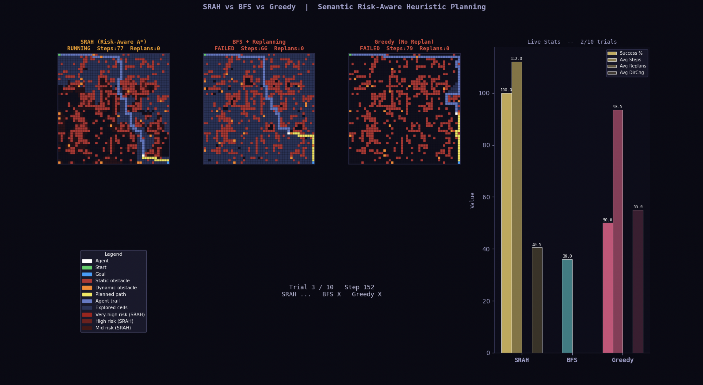

# SRAH — Semantic Risk-Aware Heuristic Planning

## What is SRAH?

Classical planners like A\* and BFS treat every free cell identically — they are blind to *how risky* a cell is. SRAH (Semantic Risk-Aware Heuristic) fixes this by borrowing an insight from Large Language Models: **narrow, obstacle-surrounded passages are semantically riskier** because they offer fewer escape options if a moving obstacle appears.

SRAH encodes this as a lightweight cost function φ(s) added to the A\* edge cost — no LLM inference needed at runtime, just a fast geometric computation over the local 8-neighbourhood. The result is a planner that proactively avoids bottlenecks *before* they become blocked, rather than replanning *after* getting stuck.

This repository is the **full simulation** used to generate the paper's results, visualised live as it runs.


## What you will see when you run it

The simulation opens a single dark-themed window with **four panels** that update in real time:



### Grid panel colour key

| Colour | Meaning |
|--------|---------|
| ⬜ White | Agent (current position) |
| 🟢 Green | Start cell (top-left corner) |
| 🔵 Blue | Goal cell (bottom-right corner) |
| 🔴 Dark red | Static wall / obstacle |
| 🟠 Orange | Dynamic (moving) obstacle |
| 🟡 Yellow | Planned path ahead |
| 🟦 Blue-grey | Agent's trail (cells already visited) |
| 🟫 Dark blue | Explored cells (search frontier) |
| 🔴 Bright red tint | Very-high risk zone φ(s) — SRAH panel only |
| 🟥 Mid red tint | High risk zone — SRAH panel only |
| ▪ Dim red tint | Moderate risk zone — SRAH panel only |

### What to watch for

- **SRAH panel**: The risk overlay (red tints) highlights bottleneck corridors. Watch SRAH's yellow path curve *around* these zones. When a dynamic obstacle moves into a risky corridor, SRAH has often already avoided it entirely — this is the core advantage.
- **BFS panel**: No risk awareness — the path goes straight for the goal. BFS replans reactively when blocked, shown by the `Replans` counter ticking up and a sudden path change mid-run.
- **Greedy panel**: Commits to its first plan and never replans. Once a dynamic obstacle steps into its path, it fails immediately (banner turns red: `FAILED`). Expect this to fail most trials.
- **Live Stats panel**: After each trial completes, the grouped bar chart updates — you can watch SRAH's success rate pull ahead of BFS over the 10 trials.

### Status banners

Each panel title shows one of three states:

| Banner | Colour | Meaning |
|--------|--------|---------|
| `RUNNING` | 🟡 Orange | Agent still navigating |
| `SUCCESS` | 🟢 Green | Agent reached the goal within the step limit |
| `FAILED` | 🔴 Red | Agent got blocked or exceeded max steps |


## Results (from the paper — 200 trials)

| Planner | Success Rate | Avg Steps | Planning Time | Avg Replans |
|---------|-------------|-----------|---------------|-------------|
| **SRAH (ours)** | **62.0%** | 32.3 ± 6.2 | 2.61 ms | 1.80 |
| BFS + Replanning | 56.5% | 31.9 ± 5.3 | 0.84 ms | 1.66 |
| Greedy (no replan) | 4.0% | 30.3 ± 1.9 | 0.17 ms | 0.00 |

Key takeaways:
- SRAH outperforms BFS by **9.7% relative** improvement in task success rate.
- SRAH's 2.61 ms planning overhead is negligible for real-time robotic systems (10–50 Hz control loops) and **orders of magnitude faster** than LLM inference (500–5000 ms).
- The Greedy planner's near-zero success rate confirms that closed-loop replanning is essential in dynamic environments — consistent with the failure mode that motivated D\* Lite.
- SRAH's higher replan count (1.80 vs 1.66 for BFS) reflects *proactive* route revision in risky zones, not more failures.


## How the semantic cost function works

For every free cell s, SRAH counts how many of its 8 neighbours are blocked — A(s) — and assigns a traversal penalty:

```
φ(s) =  10.0   if A(s) ≥ 5   (severe bottleneck)
         6.0   if A(s) = 4   (high risk)
         3.0   if A(s) = 3   (moderate risk)
         0.0   otherwise     (open corridor)
```

Additionally, φ(s) accumulates two more signals:

**Predictive dynamic risk** — projects each moving obstacle's trajectory up to 5 steps forward and penalises cells near predicted positions, decaying with time-horizon and Manhattan distance:
```
penalty += (6.0 / t) * (1.0 / (dist + 1))   for t in 1..5, dist ≤ 2
```

**Escape route analysis** — penalises cells with limited cardinal neighbours (dead ends / narrow corridors):
```
+8.0  if free cardinal neighbours ≤ 1   (dead end)
+3.0  if free cardinal neighbours == 2  (narrow corridor)
```

The total A\* edge cost becomes `c(s, s') = 1 + φ(s')`, steering the agent away from dangerous zones at planning time rather than at collision time.


## Project Structure

```
srah_simulation/
├── main.py            # Entry point — run this file
├── config.py          # All tunable parameters and colour constants
├── grid_world.py      # GridWorld class: obstacles, dynamics, φ(s) computation
├── planners.py        # astar_srah · bfs_with_replanning · greedy_no_replan
├── agent.py           # Agent class: steps, replans, tracks statistics
├── visualisation.py   # render_panel · render_live_stats (matplotlib)
└── README.md
```


## Installation

**Requirements:** Python 3.8+

```bash
pip install matplotlib numpy
```

No other dependencies. No GPU required. Runs on any machine with a display.


## Usage

```bash
cd srah_simulation
python main.py
```

The window opens immediately. Each trial runs for up to `MAX_STEPS` steps. The window pauses for 15 seconds at the end of each trial so you can study the stats before moving on to the next seed.


## Configuration

All parameters are in `config.py` — no other file needs to be touched.

| Parameter | Default | Description |
|-----------|---------|-------------|
| `GRID_SIZE` | 45 | Grid dimensions (N × N) |
| `OBSTACLE_DENSITY` | 0.25 | Fraction of cells that are static walls |
| `NUM_DYNAMIC_OBSTACLES` | 20 | Number of moving obstacles |
| `DYNAMIC_MOVE_INTERVAL` | 2 | Simulation steps between obstacle movements |
| `MAX_STEPS` | 450 | Step limit before a trial is declared failed |
| `NUM_TRIALS` | 10 | Number of independent trials to run |
| `ANIMATION_DELAY` | 0.05 | Seconds per rendered frame (lower = faster playback) |
| `ASTAR_W` | 1.0 | Weighted A\* inflation factor |

To replicate the exact paper evaluation (15×15 grid, 200 trials):
```python
# config.py
GRID_SIZE             = 15
OBSTACLE_DENSITY      = 0.20
NUM_DYNAMIC_OBSTACLES = 10
MAX_STEPS             = 300
NUM_TRIALS            = 200
```


## Citation

If you use this code or build on this work, please cite:

```bibtex
@article{durrani2026srah,
  title   = {Semantic Risk-Aware Heuristic Planning for Robotic Navigation
             in Dynamic Environments: An LLM-Inspired Approach},
  author  = {Durrani, Hamza Ahmed and Durrani, Rafay Suleman},
  journal = {arXiv preprint arXiv:2605.02862},
  year    = {2026}
}
```
free to use, modify, and distribute with attribution.
